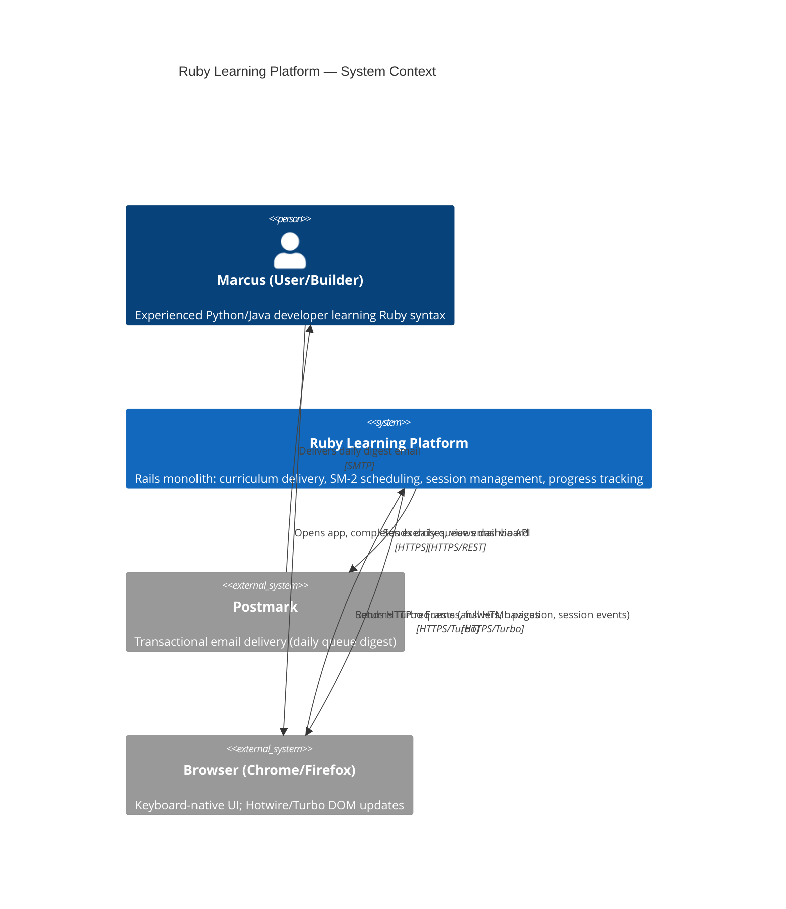
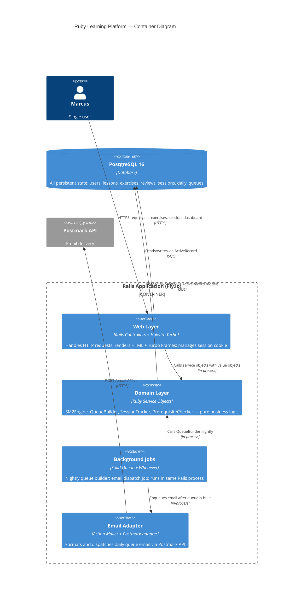
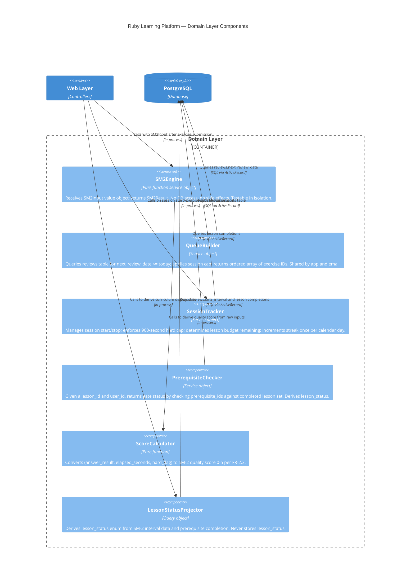

# Architecture Design — Ruby Learning Platform

**Feature ID**: ruby-learning-platform
**Phase**: DESIGN
**Date**: 2026-03-10
**Status**: Accepted

---

## System Architecture Overview

The platform is a **modular monolith** with dependency inversion (ports-and-adapters). All components share one Rails process and one PostgreSQL database. External dependencies (Postmark email, browser client) are accessed through adapter ports — the domain core has no direct dependency on external systems.

This satisfies the single-user, $5-20/month hosting target, the "simplest solution first" principle, and the requirement for SM-2 as a pure function isolated from Rails internals.

---

## C4 System Context (Level 1)



---

## C4 Container (Level 2)



---

## C4 Component (Level 3) — Domain Layer

The domain layer has 5+ internal components warranting a Component diagram.



---

## Request Flow: Onboarding (US-001, US-002, US-003)

```
Browser                    OnboardingController         SM2Engine          DB
  |                               |                         |               |
  |-- GET /register -------------->|                         |               |
  |<- render registration form ---|                         |               |
  |                               |                         |               |
  |-- POST /register (email) ----->|                         |               |
  |                               |-- INSERT users ----------+-------------->|
  |<- redirect /onboarding/step2 -|                         |               |
  |                               |                         |               |
  |-- POST /onboarding/experience->|                         |               |
  |                               |-- UPDATE users.experience_level=expert ->|
  |<- redirect /lessons/1 --------|                         |               |
  |                               |                         |               |
  |-- GET /lessons/1 ------------->|                         |               |
  |<- render Lesson 1 (Ruby Blocks)|                         |               |
  |                               |                         |               |
  |-- POST /exercises/1/submit --->|  ExercisesController    |               |
  |   (answer="select",           |-- call ScoreCalculator --|               |
  |    elapsed=8s)                |   score = 5              |               |
  |                               |-- call SM2Engine(input) ->|              |
  |                               |<- SM2Result(interval=1, ->|              |
  |                               |   ef=2.5, reps=1)        |               |
  |                               |-- INSERT reviews ---------+-------------->|
  |                               |-- UPDATE sessions.duration +------------->|
  |<- Turbo Frame: feedback panel-|                         |               |
  |   "Correct. Review in 1 day" |                         |               |
```

---

## Request Flow: Daily Session (US-004, US-005, US-006, US-020)

```
Browser                  SessionsController       QueueBuilder    SessionTracker    DB
  |                            |                       |               |             |
  |-- GET /session/start ------>|                       |               |             |
  |                            |-- call QueueBuilder -->|               |             |
  |                            |   (user_id, today)    |-- SELECT reviews             |
  |                            |                       |   where nrd<=today -------->|
  |                            |<- [ex_ids ordered] ---|               |             |
  |                            |-- call SessionTracker.start -------->|             |
  |                            |                       |               |-- INSERT session|
  |<- render session start     |                       |               |             |
  |   (queue preview, budget)  |                       |               |             |
  |                            |                       |               |             |
  |-- POST /session/advance --->|  ExercisesController  |               |             |
  |   (exercise submission)    |-- check time_remaining: 900-elapsed ->|             |
  |                            |   if < 30s: cap reached               |             |
  |                            |   else: allow next exercise           |             |
  |                            |-- persist SM-2 result ----------------+------------>|
  |<- Turbo Frame or redirect  |                       |               |             |
  |                            |                       |               |             |
  |-- POST /session/complete -->|                       |               |             |
  |                            |-- SessionTracker.complete ----------->|             |
  |                            |                       |               |-- UPDATE streak|
  |<- render session summary   |                       |               |             |
```

---

## Request Flow: SM-2 Review Submission (US-007, US-008)

```
ExercisesController
        |
        |-- Receive: exercise_id, answer, elapsed_seconds, hard_flag
        |
        |-- ScoreCalculator.call(answer_result, elapsed_seconds, hard_flag)
        |   Returns: Integer (0-5)
        |
        |-- SM2Engine.call(SM2Input.new(
        |       repetitions: review.repetitions,
        |       interval: review.sm2_interval,
        |       ease_factor: review.sm2_ease_factor,
        |       quality: score
        |   ))
        |   Returns: SM2Result.new(
        |       interval: Integer,
        |       ease_factor: Float,
        |       repetitions: Integer,
        |       next_review_date: Date
        |   )
        |
        |-- ActiveRecord transaction:
        |   INSERT/UPDATE reviews SET
        |     sm2_interval = result.interval,
        |     sm2_ease_factor = result.ease_factor,
        |     repetitions = result.repetitions,
        |     next_review_date = result.next_review_date,
        |     answer_result = answer_result,
        |     reviewed_at = Time.current
        |
        |-- Render Turbo Frame: feedback panel with next_review_date in plain language
```

---

## Session Cap Enforcement Mechanism

The 900-second cap is **server-side structural**, not client-side advisory (US-020, FR-9.1 through FR-9.4).

**Mechanism**:
1. `sessions.started_at` recorded as UTC timestamp when session begins (POST /session/start).
2. On every exercise submission request, `SessionTracker` computes `elapsed = Time.current - session.started_at`.
3. If `elapsed >= 850` seconds (50-second warning window): return cap-warning Turbo Frame; no new exercise started.
4. If `elapsed >= 900` seconds: any submitted answer is still persisted (not lost), but the response redirects to session summary. No new exercise can begin.
5. Client-side session timer is a mirrored display only — it does not gate any behavior.

**Why server-side**: Client-side timers are manipulable (browser clock, JS pause). The session cap is a product invariant, not a UI suggestion. Server controls the gate.

**Session state stored in DB**: `sessions` table holds `started_at`, `ended_at`, `duration_seconds`, `exercises_completed`. If the user refreshes mid-session, the server recomputes elapsed from `started_at`.

---

## Email Queue Generation Flow (US-009, FR-3.2, FR-4.1)

```
Whenever Cron (2:00 AM UTC)
        |
        v
QueueBuilderJob (Solid Queue)
        |
        |-- For each opted-in user:
        |   QueueBuilder.build(user_id: id, date: Date.today)
        |   |
        |   |-- SELECT exercises.id, lessons.id, reviews.next_review_date
        |   |   FROM reviews
        |   |   JOIN exercises ON exercises.id = reviews.exercise_id
        |   |   WHERE reviews.user_id = ?
        |   |     AND reviews.next_review_date <= ?
        |   |   ORDER BY reviews.next_review_date ASC
        |   |   (oldest overdue first — FR-3.6)
        |   |
        |   |-- Apply session cap: estimate 45s per exercise; drop exercises
        |   |   beyond 15min budget (FR-3.5)
        |   |
        |   |-- Upsert daily_queues record (idempotent — NFR-2.4)
        |   |   ON CONFLICT (user_id, queue_date) DO UPDATE SET
        |   |     exercise_ids = EXCLUDED.exercise_ids
        |
        v
EmailDispatchJob (Solid Queue, enqueued after QueueBuilderJob)
        |
        |-- For each user with non-empty queue AND email opted-in:
        |   DailyQueueMailer.daily_digest(user, queue).deliver_later
        |
        |-- Postmark API call (Action Mailer + postmark-rails adapter)
        |
        |-- On delivery failure: log error, enqueue retry once after 15 minutes
        |   (AC-009-05)
```

**Idempotency guarantee**: `daily_queues` has a unique index on `(user_id, queue_date)`. Running `QueueBuilder` twice produces an `ON CONFLICT DO UPDATE` — same result, no duplicate rows. Email dispatch checks `daily_queues.email_sent_at IS NULL` before sending — prevents duplicate sends (NFR-2.4).

---

## Background Job Architecture

```
Whenever (crontab)
  schedule.rb:
    every :day, at: '2:00 am' do
      runner "QueueBuilderJob.perform_later"
    end

Solid Queue Workers (Rails process)
  QueueBuilderJob   → calls QueueBuilder service
  EmailDispatchJob  → calls DailyQueueMailer; handles Postmark retry
  (No other background jobs needed for MVP)
```

Solid Queue runs in the same process as the Rails web server on Fly.io (single dyno). The `config/recurring.yml` Solid Queue scheduler is an alternative to Whenever for containerized deployments — both are acceptable; Whenever is chosen for its familiar cron syntax.

---

## Security Considerations

### CSRF Protection
Rails `protect_from_forgery with: :exception` is enabled globally. All POST/PATCH/DELETE routes include CSRF token. Turbo automatically includes the CSRF token on form submissions.

### Session Management
Single-user tool. Session stored in signed, encrypted Rails cookie (`config.session_store :cookie_store, key: '_ruby_learn_session'`). Cookie is `httponly: true, secure: true, same_site: :strict`. No session data in database except the `sessions` table for duration tracking (not auth state).

No authentication gem required (Devise, etc.) for single-user. A simple email + magic-link or password + bcrypt approach is sufficient. The architecture accommodates either; password + bcrypt with `has_secure_password` is the minimum implementation.

### Data at Rest
PostgreSQL data encrypted at rest by Fly.io's managed volumes (AES-256). Application secrets (Postmark API key, session secret) stored as Fly.io secrets (environment variables), never in source code.

### Input Validation
Exercise answers: sanitized before comparison; no eval, no dynamic code execution. Lesson content is seeded static data — no user-generated content stored that could introduce XSS risk. ERB templates use `h()` auto-escaping by default.

### HTTPS
Fly.io provides automatic TLS termination. All traffic is HTTPS. `config.force_ssl = true` in production.

---

## Dependency Inversion (Ports and Adapters)

```
Domain Core (no external dependencies):
  SM2Engine       — receives SM2Input value object, returns SM2Result
  ScoreCalculator — receives raw answer data, returns Integer score
  QueueBuilder    — receives user_id + date, returns array of exercise IDs
  SessionTracker  — receives session events, returns session state

Driven Ports (domain → external):
  EmailPort       — interface: send_daily_digest(user, queue)
  StoragePort     — satisfied by ActiveRecord models (ReviewRepository, SessionRepository)

Adapters (satisfy ports):
  PostmarkAdapter — satisfies EmailPort via Action Mailer + postmark-rails
  ActiveRecordAdapters — satisfy StoragePort; keep ActiveRecord out of service objects

Driving Ports (external → domain):
  HTTP requests   → Controllers → Service objects
  Cron jobs       → Job classes → Service objects
```

SM2Engine and ScoreCalculator have zero Rails/ActiveRecord dependencies. They receive value objects and return value objects. This is the architectural constraint required by NFR-5.1 and the product's core promise.

---

## Walking Skeleton (US-000) — Architectural Detail

The walking skeleton establishes the full vertical slice before any other story is built. It proves the stack is deployable and the critical path works end-to-end.

### Minimum Vertical Slice

One lesson + one exercise + one SM-2 recording, deployed and accessible from a real URL.

**What must work**:
1. `GET /` — landing page loads, returns 200, no error
2. `GET /lessons/1` — Lesson 1 (Ruby Blocks) renders with seeded content and Python/Java comparison
3. `GET /exercises/1` — Exercise 1.1 renders with focused input field and 30-second timer
4. `POST /exercises/1/submit` with `answer=select` — SM-2 record written to DB; feedback rendered; next_review_date = today + 1
5. `POST /exercises/1/submit` with `answer=wrong` — SM-2 record written; interval = 1; incorrect feedback shown
6. Timer auto-advance — after 30s without submission, exercise auto-advances and records `timeout` with interval = 1

### Tables Required for Walking Skeleton

All 7 tables must exist (migrations 001-007) but only 4 need data:

| Table | Walking Skeleton requirement |
|-------|----------------------------|
| users | 1 seeded test user (or auth skipped in development) |
| modules | 1 seeded module (id=1, "Ruby Fundamentals for Polyglots") |
| lessons | 1 seeded lesson (id=1, "Ruby Blocks", module_id=1, prerequisite_ids=[]) |
| exercises | 1 seeded exercise (id=1, lesson_id=1, fill_in_blank, correct_answer="select") |
| reviews | Empty at start; written by exercise submission |
| sessions | Empty at start; created on session start |
| daily_queues | Empty at start; written by QueueBuilderJob |

### Walking Skeleton End-to-End Flow

```
Request:  POST /exercises/1/submit
          body: { answer: "select", elapsed_seconds: 8, hard_flag: false }

Step 1:   ExercisesController receives request
Step 2:   Evaluate answer: "select" == correct_answer "select" → answer_result = :correct
Step 3:   ScoreCalculator.call(:correct, 8, false) → score = 5 (correct + elapsed < 10)
Step 4:   Find existing review for (user_id, exercise_id=1) → nil (first attempt)
          Build SM2Input: { repetitions: 0, interval: 1, ease_factor: 2.50, quality: 5 }
Step 5:   SM2Engine.call(SM2Input) →
          SM2Result: { interval: 1, ease_factor: 2.50, repetitions: 1,
                       next_review_date: today + 1 }
Step 6:   ActiveRecord transaction:
          INSERT INTO reviews (user_id, exercise_id, sm2_interval, sm2_ease_factor,
            repetitions, next_review_date, answer_result, quality_score, reviewed_at)
          VALUES (?, 1, 1, 2.50, 1, today+1, 'correct', 5, NOW())
Step 7:   SessionTracker.record_exercise(session_id) → exercises_completed += 1
Step 8:   Render Turbo Frame: feedback panel showing "Correct" +
          "This concept will be reviewed in 1 day — {tomorrow's date}"

Database state after:
  reviews.sm2_interval = 1          ← AC-000-04
  reviews.next_review_date = today+1 ← AC-000-04
  reviews.sm2_ease_factor = 2.50
  reviews.repetitions = 1
```

Note: AC-000-04 in the acceptance criteria specifies `next_review_date = today + 3 days` for a correct answer — this reflects the SM-2 I(1)=1 day interval (first review is tomorrow), with the description "3 days" likely referring to the second interval. The implementation follows the SM-2 spec: first correct answer → I(1) = 1 day. The AC wording should be reconciled by acceptance-designer; architecture follows the SM-2 spec as defined in FR-2.2 and NFR-5.1.

### Routes Required for Walking Skeleton

```ruby
# config/routes.rb (walking skeleton minimum)
root to: "home#index"
resources :lessons, only: [:show]
resources :exercises, only: [:show] do
  post :submit, on: :member
end
resources :sessions, only: [:new, :create]
```

### CI/CD Configuration for Day-1 Deployability

```yaml
# .github/workflows/ci.yml (minimum)
name: CI
on: [push, pull_request]
jobs:
  test:
    runs-on: ubuntu-latest
    services:
      postgres:
        image: postgres:16
        env:
          POSTGRES_PASSWORD: postgres
        options: >-
          --health-cmd pg_isready
          --health-interval 10s
    steps:
      - uses: actions/checkout@v4
      - uses: ruby/setup-ruby@v1
        with:
          bundler-cache: true
      - run: bin/rails db:create db:schema:load db:seed
      - run: bundle exec rspec spec/models spec/services
        # Walking skeleton: unit tests only; no browser tests yet

  deploy:
    needs: test
    if: github.ref == 'refs/heads/main'
    runs-on: ubuntu-latest
    steps:
      - uses: actions/checkout@v4
      - uses: superfly/flyctl-actions/setup-flyctl@master
      - run: flyctl deploy --remote-only
        env:
          FLY_API_TOKEN: ${{ secrets.FLY_API_TOKEN }}
```

**Day-1 deploy requirements**:
- `fly.toml` configured with app name, region, and build config
- `Dockerfile` (Rails generates with `./bin/rails generate dockerfile`)
- `POSTMARK_API_TOKEN`, `RAILS_MASTER_KEY`, `DATABASE_URL` set as Fly.io secrets
- `db:seed` includes the 7 walking-skeleton rows
- Main branch protected: CI must pass before merge
