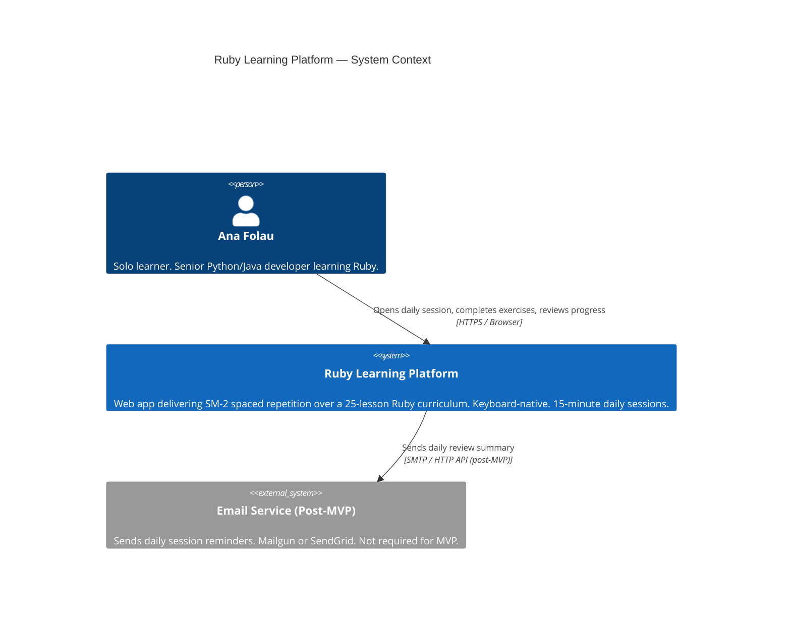
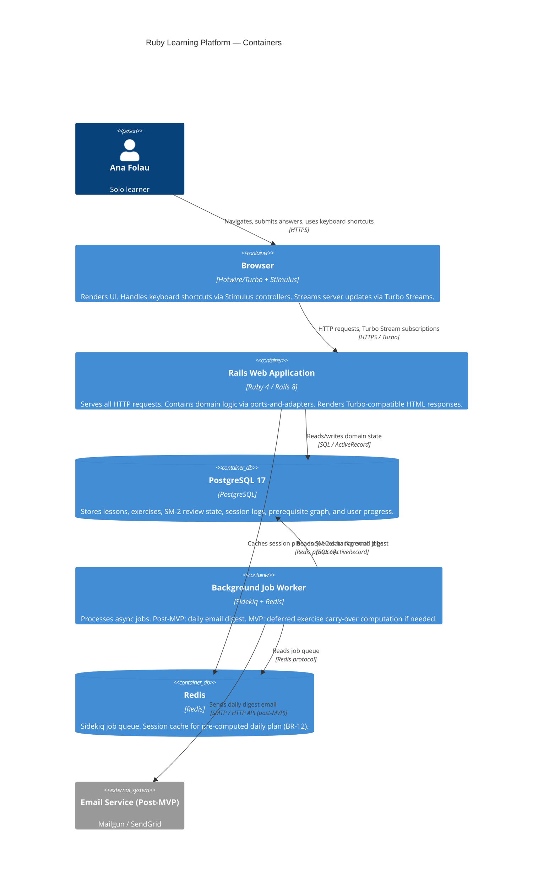
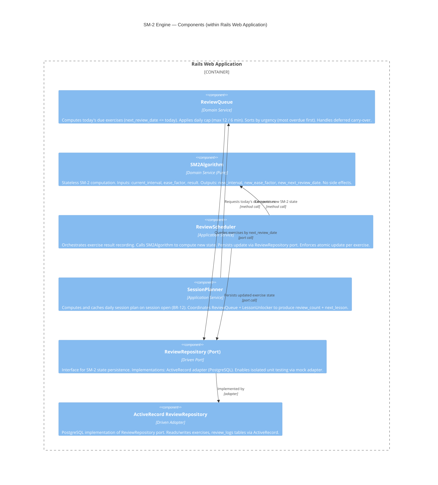
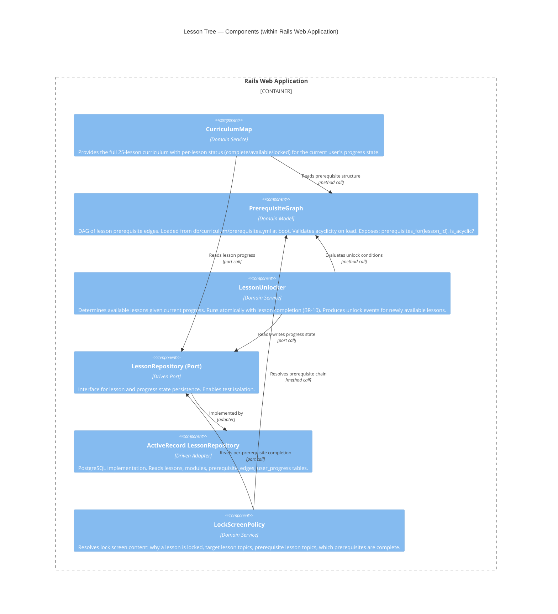

# Architecture Design — Ruby Learning Platform

**Feature**: ruby-learning-platform
**Date**: 2026-03-09
**Status**: Approved
**Paradigm**: Object-Oriented (Ruby 4)

---

## System Context

A single-user personal web application for learning Ruby syntax via SM-2 spaced repetition. No external auth. No multi-tenancy. Deployment target: self-hosted PaaS (Heroku/Railway/Fly.io) at $5–20/month.

### Quality Attributes (Priority Order)

| Rank | Attribute | Driver |
|------|-----------|--------|
| 1 | Maintainability | Solo developer; years-long extension horizon |
| 2 | Testability | SM-2 algorithm and prerequisite gating are correctness-critical |
| 3 | Time-to-market | Personal tool; weeks not months |
| 4 | Simplicity | Solo dev economics; no over-engineering |
| 5 | Keyboard usability | Developer-grade UI requirement |

---

## C4 System Context (Level 1)



---

## C4 Container Diagram (Level 2)



---

## C4 Component Diagram — SM-2 Engine (Level 3)

The SM-2 engine has 5+ internal components and is correctness-critical. Component diagram mandatory.



---

## C4 Component Diagram — Lesson Tree (Level 3)



---

## Architectural Style

**Modular monolith with ports-and-adapters (hexagonal).**

All domain logic lives in the Rails app, isolated from infrastructure via port interfaces. Rails MVC provides the web delivery layer (primary adapter). ActiveRecord adapters implement driven ports. Turbo/Stimulus handle browser-side interactivity without a separate frontend build.

### Rationale

- Solo developer: modular monolith eliminates distributed systems operational overhead.
- Testability #2 priority: ports-and-adapters enables full isolation of SM-2Algorithm and PrerequisiteGraph — the correctness-critical components — without database.
- Rails conventions reduce boilerplate; well-understood for solo Ruby projects.
- Hotwire eliminates need for a separate JavaScript frontend while supporting keyboard-native interaction via Stimulus.

### Rejected Alternatives

**Alternative 1: Layered MVC without ports-and-adapters**
- What: Standard Rails MVC, no explicit port interfaces; controllers call ActiveRecord directly.
- Expected Impact: Faster initial setup; no interface definitions needed.
- Why Insufficient: SM-2 algorithm and prerequisite gating would be tightly coupled to ActiveRecord; unit testing requires DB fixtures or complex stubs. Testability (priority #2) unmet.

**Alternative 2: Microservices (SM-2 as separate service)**
- What: SM-2 engine as standalone HTTP service; Rails app calls it over HTTP.
- Expected Impact: Independent deployability of SM-2 engine.
- Why Insufficient: Solo developer; one user. Distributed systems overhead (service discovery, HTTP contracts, separate deploys) not justified. Adds weeks of infrastructure work. Time-to-market (priority #3) severely impacted.

---

## Module Boundaries

The Rails application is organized into bounded modules with explicit dependency rules. Dependencies flow inward only (toward domain).

```
app/
  domain/
    sm2/              # SM-2 engine: algorithm, review queue, scheduler
    curriculum/       # Lesson tree, prerequisite graph, lesson unlocker
    session/          # Session planner, session state, daily plan
    progress/         # Progress tracker, retention calculator, streak
    exercise/         # Exercise types, answer evaluation, hint policy
  adapters/
    repositories/     # ActiveRecord implementations of driven ports
    web/              # Turbo/Rails controllers (primary adapters)
  ports/
    review_repository.rb
    lesson_repository.rb
    session_repository.rb
    progress_repository.rb
```

**Dependency rules:**
- `domain/` has zero Rails/ActiveRecord dependencies.
- `adapters/repositories/` depends on `domain/` ports, never on other adapters.
- `adapters/web/` depends on domain application services, never on repositories directly.
- Cross-domain calls go through application services only (no cross-domain repository access).

---

## Integration Patterns

### Browser → Rails App
- Turbo Drive for standard page navigation (no full-page reload).
- Turbo Frames for exercise submission feedback (renders new state without page reload; meets 100ms feedback requirement).
- Stimulus controllers handle keyboard shortcut registration, timer countdown, focus management.
- No separate API layer; Rails renders HTML responses consumed by Turbo.

### SM-2 State Persistence (Mid-Session Durability)
- BR-12: session plan cached in Redis on session open (key: `session_plan:{session_id}`).
- Each exercise result persisted immediately (not batched) to PostgreSQL — ensures SM-2 state survives browser refresh (AC-05-06).
- Session record marked complete atomically after all exercises persist.

### Prerequisite Unlock (Atomicity)
- Lesson completion and prerequisite resolver run inside a single database transaction.
- No intermediate state where lesson is complete but successors are not evaluated.
- Satisfies BR-10 and AC-08-03.

### Background Jobs (Post-MVP)
- Sidekiq with Redis queue.
- Daily digest job: queries SM-2 due exercises for next day; sends via email service adapter.
- MVP: Sidekiq infrastructure included but no active jobs.

---

## Quality Attribute Strategies

### Maintainability
- Ports-and-adapters: swap infrastructure (DB, email provider) without touching domain logic.
- Module boundaries enforced by directory structure and RuboCop custom cops.
- All 25 lessons + 75 exercises in structured YAML (`db/curriculum/`); content changes require no code changes.
- Curriculum schema versioned; content authoring separated from code authoring.

### Testability
- SM-2Algorithm: pure function, no dependencies, testable with plain RSpec examples.
- PrerequisiteGraph: in-memory DAG, no DB; testable with YAML fixture.
- Domain services tested through port interfaces using in-memory test adapters.
- No ActiveRecord in domain layer = no DB required for unit tests.

### Performance
- Session dashboard 500ms target: session plan pre-computed and cached in Redis on open.
- SM-2 queue 200ms target: PostgreSQL index on `exercises.next_review_date`; query returns max 12 rows.
- Curriculum tree 300ms target: 25 lessons is trivial; single query with eager-loaded modules.
- Exercise feedback 100ms target: Turbo Frame partial re-render; no full page reload.

### Reliability
- SM-2 state durability: exercise results persisted per-exercise, not batched at session end.
- Lesson completion atomicity: database transaction wraps completion + prerequisite unlock.
- Esc mid-lesson saves position: exercise position stored in session_state table before navigation.

### Keyboard Usability
- Stimulus controllers: single keymap config file; all shortcuts registered globally.
- Focus management: after overlay close, focus returns to triggering element (AC-07 compliance).
- No action >3 keypresses from any screen (audited per user story).

---

## Deployment Architecture

Single Heroku/Railway/Fly.io dyno (or equivalent):
- Web process: Puma (multi-threaded; 2-4 threads sufficient for 1 user).
- Worker process: Sidekiq (1 worker; post-MVP only).
- PostgreSQL: managed add-on (Heroku Postgres Hobby / Railway PostgreSQL / Fly.io Postgres).
- Redis: managed add-on (Heroku Redis / Railway Redis / Fly.io Redis).
- Target cost: $5–20/month.

No CDN required (single user, no static asset scale concern). HTTPS via PaaS TLS termination.

---

## Security

Single-user personal tool with no authentication requirement. Rails built-in protections apply:
- **CSRF**: Rails `protect_from_forgery` active by default on all POST/PATCH/DELETE routes
- **XSS**: ERB auto-escapes all user-facing output; no raw HTML rendering of user input
- **SQL injection**: ActiveRecord parameterized queries; no string-interpolated SQL in adapters
- **Dependency scanning**: Brakeman (static analysis) in development toolchain; `bundler-audit` for known CVEs

No user-generated content stored beyond exercise answers (which are never re-rendered as HTML). Authentication not in scope; no session auth attack surface.

---

## ADR Index

| ADR | Decision |
|-----|---------|
| ADR-001 | Language and Framework: Ruby 4 / Rails 8 |
| ADR-002 | Database: PostgreSQL 17 |
| ADR-003 | Frontend Approach: Hotwire (Turbo + Stimulus) |
| ADR-004 | SM-2 Implementation Strategy |
| ADR-005 | Prerequisite Gating Model |
