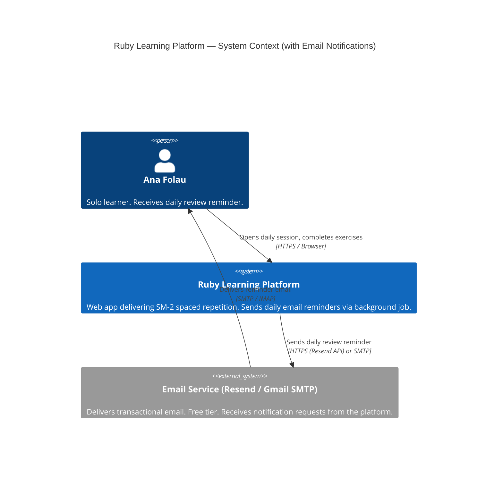
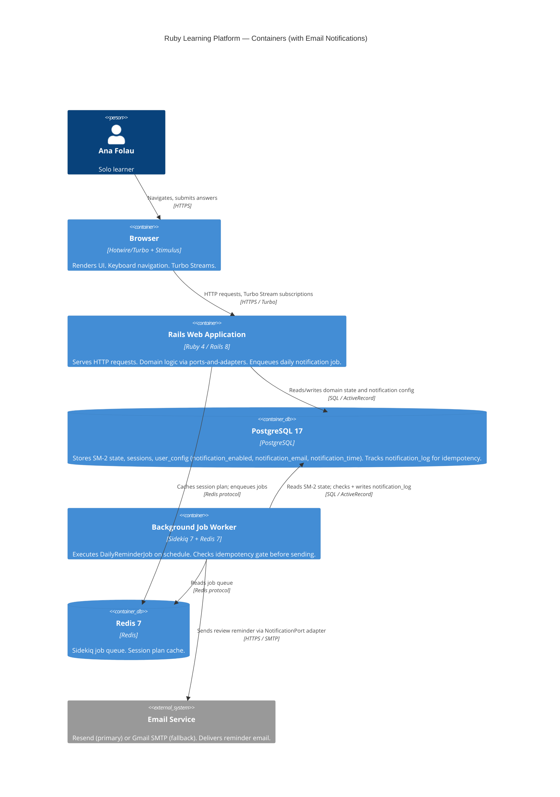
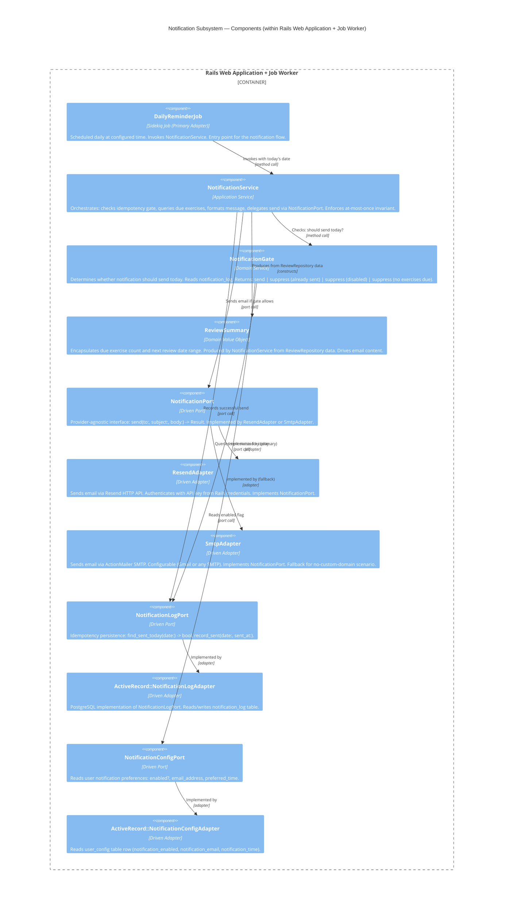

# Email Notifications — Architecture Design

**Feature**: email-notifications
**Date**: 2026-03-09
**Status**: Approved
**Parent Architecture**: `docs/feature/ruby-learning-platform/design/architecture-design.md`
**ADR**: `docs/adrs/ADR-006-email-provider.md`

---

## Feature Summary

Send at most one daily review reminder email to Ana Folau. The email surfaces how many SM-2 exercises are due and encourages her to open the platform. Constraint: never send more than once per calendar day regardless of configuration, retry, or system restarts.

---

## Quality Attributes (Feature-Level)

| Rank | Attribute | Driver |
|------|-----------|--------|
| 1 | Reliability | At-most-once constraint is invariant; double-send is a defect |
| 2 | Simplicity | Solo dev; minimal infrastructure addition to existing stack |
| 3 | Maintainability | Provider-agnostic port enables swap without domain changes |

---

## C4 System Context (Level 1)



---

## C4 Container Diagram (Level 2)



---

## C4 Component Diagram — Notification Subsystem (Level 3)

The notification subsystem has 5+ internal components across domain and adapter layers.



---

## Component Architecture

### Domain Module: notification (new)

**Bounded context**: Daily review reminder lifecycle — gate evaluation, content assembly, delivery coordination.

**Owns**:
- `NotificationGate` — domain service; evaluates three suppression conditions
- `ReviewSummary` — value object: `{due_count: Integer, exercises: [...], period: Date}`
- `NotificationService` — application service; orchestrates full notification flow

**Does NOT own**:
- SM-2 state (reads through `ReviewRepository` port — existing port, no new interface)
- Email delivery mechanism (delegated through `NotificationPort`)
- Idempotency persistence (delegated through `NotificationLogPort`)
- User configuration (delegated through `NotificationConfigPort`)

**Driven ports**:
- `NotificationPort` — `send(to:, subject:, body:) -> Result`
- `NotificationLogPort` — `sent_today?(date:) -> bool`, `record_sent(date:, sent_at:)`
- `NotificationConfigPort` — `notification_enabled? -> bool`, `recipient_email -> String`, `preferred_send_time -> Time`

**Invariants enforced**:
- At most one notification per calendar day — enforced by `NotificationGate` before every send
- No send if `notification_enabled? == false`
- No send if `due_count == 0` (suppress empty reminders — BR-new-01)
- Failed send does not write to `notification_log` — retry is safe

### Primary Adapter: DailyReminderJob

A Sidekiq job scheduled via `sidekiq-cron` (or `whenever` gem for on-premise cron) at the time stored in `user_config.notification_time`. Invokes `NotificationService#call(date: Date.today)`. No domain logic; translation only.

### Module Placement

```
app/
  domain/
    notification/               # New bounded context
      notification_gate.rb      # Suppression logic
      notification_service.rb   # Orchestrator
      review_summary.rb         # Value object
  ports/
    notification_port.rb        # Driven port (send interface)
    notification_log_port.rb    # Driven port (idempotency)
    notification_config_port.rb # Driven port (user prefs)
  adapters/
    email/
      resend_adapter.rb         # Resend HTTP API implementation
      smtp_adapter.rb           # ActionMailer SMTP implementation
    repositories/
      notification_log_adapter.rb   # PostgreSQL implementation
      notification_config_adapter.rb # user_config reader
  jobs/
    daily_reminder_job.rb       # Sidekiq job (primary adapter)
```

---

## At-Most-Once-Per-Day Constraint Design

### Invariant

`notification_log` contains at most one row per calendar date. `NotificationGate` checks this before every send. A successful send atomically writes the row.

### Idempotency Flow

```
DailyReminderJob fires (scheduled or manual retry)
  → NotificationService#call(date: today)
      → NotificationGate#allow?(date: today)
          → NotificationConfigPort#notification_enabled?    [user_config read]
              → false: return Suppressed(:disabled)
          → NotificationLogPort#sent_today?(date: today)    [notification_log read]
              → true: return Suppressed(:already_sent)
          → ReviewRepository#exercises_due_today            [review_states read]
              → empty: return Suppressed(:nothing_due)
          → return Allowed
      → Gate returns Suppressed: exit, no side effects
      → Gate returns Allowed:
          → Build ReviewSummary from due exercises
          → NotificationPort#send(to:, subject:, body:)
              → On success: NotificationLogPort#record_sent(date:, sent_at:)
              → On failure: raise (Sidekiq retries; idempotency gate prevents double-send on retry)
```

### Why This Is Safe Under Retry

Sidekiq retries failed jobs. The idempotency gate (`sent_today?`) is checked at the start of every attempt. If a send succeeded but `record_sent` failed (network error after send), the job will retry, `sent_today?` returns false (row not written), and a second email is sent. To prevent this edge case, `record_sent` is called immediately after a successful send in the same method, not in a separate transaction step. The window is milliseconds; acceptable for a personal tool.

For strict once-only semantics (if required): wrap send + record in a distributed lock (`Redis::Lock`). Not implemented by default — overkill for a single-user personal tool.

### Scheduling

**On-premise (Docker Compose) deployment**: Use `sidekiq-scheduler` gem (MIT license) to configure the daily job schedule in `config/sidekiq.yml`. The schedule reads `notification_time` from `user_config` at job initialization (not at schedule definition time — schedule fires at a fixed time, job checks config).

```yaml
# config/sidekiq.yml (schedule section — illustrative only, not implementation)
# DailyReminderJob fires at 07:00 UTC; actual send time respected via NotificationConfigPort
```

Alternative considered: `whenever` gem (cron-based). Rejected: requires host cron access, not portable across Docker environments. `sidekiq-scheduler` runs within the Sidekiq process — no host dependency.

---

## Data Model Additions

### New Table: notification_log

Idempotency record. One row per sent notification.

| Column | Type | Constraints | Notes |
|--------|------|-------------|-------|
| id | bigint | PK | |
| sent_on | date | NOT NULL, UNIQUE | Calendar date of send (idempotency key) |
| sent_at | timestamp | NOT NULL | Exact send time |
| recipient_email | varchar(255) | NOT NULL | Snapshot of email at send time |
| due_exercise_count | integer | NOT NULL | Due count included in email |
| provider | varchar(50) | NOT NULL | `resend` or `smtp` — audit trail |
| created_at | timestamp | NOT NULL | |

**Index**: `sent_on` (UNIQUE) — idempotency check is a single index lookup.

### Existing Table: user_config (no schema change required)

Columns `notification_enabled`, `notification_email`, `notification_time` are already defined in the data model. No migration required for user_config.

---

## Integration with Existing Architecture

### ReviewRepository (existing port — reused, not extended)

`NotificationService` reads due exercises via the existing `ReviewRepository#exercises_due_today` method. No new port method added. The notification domain module reads through the existing port — cross-domain via application service pattern.

**Dependency path**: `NotificationService` → `ReviewRepository` port → `ActiveRecord::ReviewRepository` adapter.

This is a cross-domain read (notification → sm2). Acceptable per the component boundary rules: application services may read shared ports. `NotificationService` does not call `sm2` domain services directly; it uses the `ReviewRepository` port interface.

### Sidekiq (existing infrastructure — already in stack)

`DailyReminderJob` is a standard Sidekiq worker. No new infrastructure. Add `sidekiq-scheduler` gem for schedule configuration.

### ActionMailer (Rails built-in)

`SmtpAdapter` wraps ActionMailer for the SMTP path. `ResendAdapter` uses the `resend` gem's HTTP API directly (bypasses ActionMailer — simpler, fewer moving parts for a single email type).

---

## Technology Stack Additions

| Component | Technology | Version | License | Rationale |
|-----------|-----------|---------|---------|-----------|
| Email provider (primary) | Resend | API v1 | SaaS (free tier) | Best Rails DX, 3000 emails/month free, no credit card |
| Rails email gem | `resend` gem | 0.x | MIT | Official Resend Ruby gem; ActionMailer-compatible |
| Job scheduler | `sidekiq-scheduler` | 5.x | MIT | In-process scheduling; Docker-portable; no host cron dependency |

**OSS health**:
- `resend` gem: actively maintained, 400+ stars, MIT — adequate for this use case
- `sidekiq-scheduler`: actively maintained, 1700+ stars, MIT — production-proven

---

## Integration Patterns

### Job Scheduling → NotificationService

`DailyReminderJob` calls `NotificationService#call` synchronously within the Sidekiq thread. No async sub-dispatch. Simple: one job, one service call, one email.

### NotificationService → ReviewRepository

Synchronous read. `NotificationService` holds a reference to `ReviewRepository` injected at construction (dependency injection via Rails initializer). No Turbo, no streaming — background context only.

### NotificationService → NotificationPort (email delivery)

Synchronous call to adapter. `ResendAdapter` makes an HTTPS POST to `api.resend.com`. `SmtpAdapter` opens SMTP connection via ActionMailer. Both return a `Result` value object (`{success: true}` or `{success: false, error: ...}`).

---

## Observability

### Failed Send Visibility

- `NotificationService` logs at `ERROR` level when `NotificationPort#send` returns failure — visible in Docker Compose logs (`docker compose logs worker`).
- Sidekiq Web UI (mounted at `/sidekiq`) shows failed job retries and error messages.
- `notification_log` table absence for a given date is the observable indicator that no send occurred that day — queryable directly in PostgreSQL.
- No additional instrumentation added — personal tool, single user, Sidekiq retry dashboard is sufficient.

---

## Security

- **Credentials**: API key (Resend) and SMTP password (Gmail) stored in `config/credentials.yml.enc` (Rails encrypted credentials). Never in environment variables directly; never in source.
- **Recipient address**: stored in `user_config.notification_email` — single-user, no injection surface.
- **Email content**: contains only system-generated data (due exercise count, date). No user-provided content rendered in email body — no XSS surface.
- **External egress**: Resend path requires port 443 egress to `api.resend.com`. Gmail SMTP requires port 587 egress to `smtp.gmail.com`. Document in Docker Compose network config.

---

## Rejected Simple Alternatives

### Alternative 1: ActionMailer with direct SMTP only (no port abstraction)

- What: Configure ActionMailer with Gmail SMTP in `config/environments/production.rb`; send from a controller action or job with no port interface.
- Expected Impact: Works immediately; 30 minutes to implement.
- Why Insufficient: Locks provider into Rails config; swapping to Resend or another provider requires changing multiple files and retest. Port abstraction is a 15-minute addition that buys full swappability. Given maintainability is priority #1, the port is justified.

### Alternative 2: No at-most-once gate; rely on Sidekiq unique jobs

- What: Use `sidekiq-unique-jobs` gem to prevent job re-enqueue; skip `notification_log` table.
- Expected Impact: Prevents duplicate scheduling (not duplicate execution across restarts).
- Why Insufficient: Unique job locks prevent duplicate enqueueing but not duplicate execution after Redis flush, container restart, or job retry after failed `record_sent`. `notification_log` in PostgreSQL provides durable, crash-safe idempotency that survives Redis flush.

### Why Multi-Step Design Is Necessary

1. At-most-once constraint requires durable idempotency storage (PostgreSQL) — not achievable with job deduplication alone.
2. Provider-agnostic port is required for maintainability (priority #1) — direct ActionMailer config fails this.
3. The `notification` bounded context must not depend on `sm2` internals — cross-domain boundary requires explicit port mediation.

---

## Roadmap Steps

These steps integrate into the DELIVER wave roadmap. Ordered for TDD execution.

```yaml
step_N1:
  title: "Notification data model and idempotency infrastructure"
  description: "Add notification_log table migration and NotificationLogPort + adapter."
  acceptance_criteria:
    - "notification_log table created with sent_on UNIQUE index"
    - "NotificationLogPort interface defined with sent_today? and record_sent methods"
    - "ActiveRecord adapter satisfies port contract"
    - "In-memory test adapter available for domain tests"

step_N2:
  title: "NotificationGate domain service"
  description: "Gate evaluates three suppression conditions; returns Allowed or Suppressed with reason."
  acceptance_criteria:
    - "Gate suppresses when notification_enabled is false"
    - "Gate suppresses when notification_log already has today's row"
    - "Gate suppresses when no exercises are due today"
    - "Gate returns Allowed when all conditions pass"
    - "Gate testable without database using in-memory adapters"

step_N3:
  title: "NotificationService orchestration and email sending"
  description: "Service invokes gate, builds ReviewSummary, delegates to NotificationPort, records send."
  acceptance_criteria:
    - "Suppressed gate result exits without side effects"
    - "Allowed gate result triggers send via NotificationPort"
    - "Successful send writes to notification_log via NotificationLogPort"
    - "Failed send does not write to notification_log (retry-safe)"

step_N4:
  title: "Email provider adapters (Resend + SMTP)"
  description: "Implement ResendAdapter and SmtpAdapter against NotificationPort interface."
  acceptance_criteria:
    - "ResendAdapter sends via Resend API using credentials from Rails credentials store"
    - "SmtpAdapter sends via ActionMailer SMTP using credentials from Rails credentials store"
    - "Both adapters return Result value with success/failure signal"
    - "Adapter is selected via Rails environment config (no domain code change)"

step_N5:
  title: "DailyReminderJob and schedule configuration"
  description: "Sidekiq job wires NotificationService; sidekiq-scheduler configures daily execution."
  acceptance_criteria:
    - "DailyReminderJob invokes NotificationService with today's date"
    - "Job scheduled daily via sidekiq-scheduler (no host cron dependency)"
    - "Job can be triggered manually for testing"
    - "Idempotency gate prevents double-send on manual re-run same day"
```

---

## ADR Index (Email Notifications)

| ADR | Decision |
|-----|---------|
| ADR-006 | Email Provider: Resend (primary), Gmail SMTP (fallback) |
